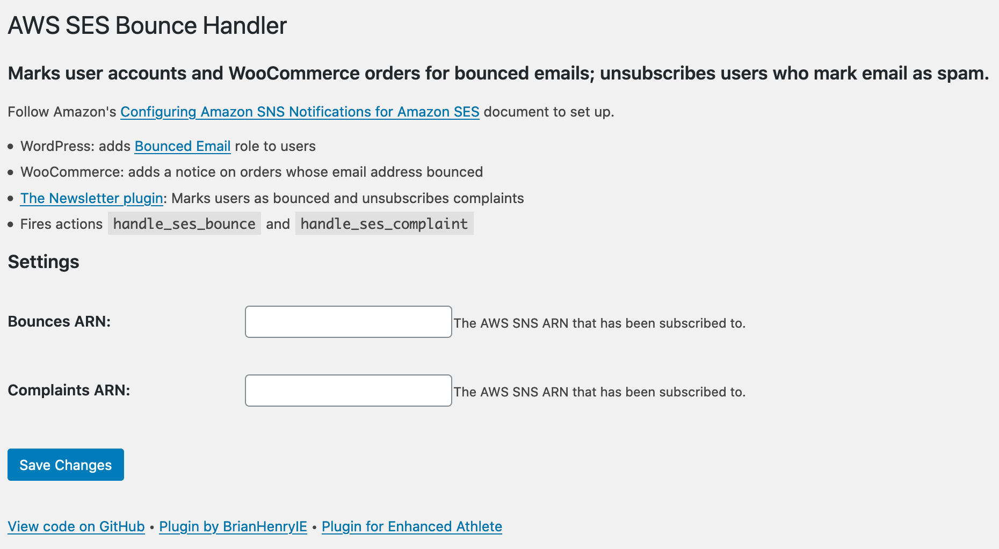
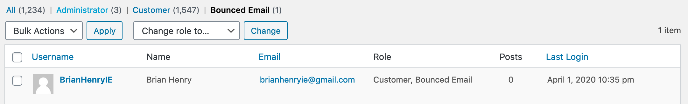
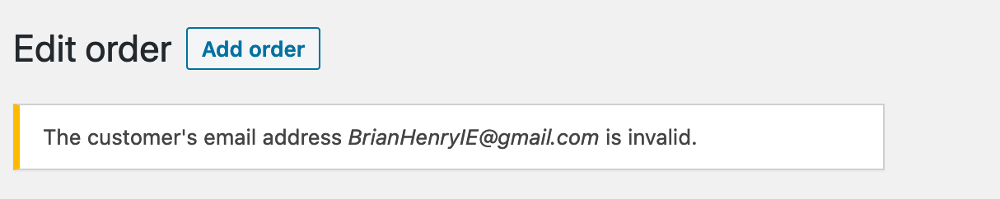

[](https://github.com/EnhancedAthlete/ea-wp-aws-ses-bounce-handler) [](https://github.com/WordPress-Coding-Standards/WordPress-Coding-Standards) [](https://www.gnu.org/licenses/old-licenses/gpl-2.0.en.html) []()

# AWS SES Bounce Handler

A WordPress plugin to unsubscribe users from email lists when AWS SES sends a bounce or complaint report.

## Overview

This plugin is for WordPress sites which are configured to send email using Amazon SES.

[What Is Amazon SES?](https://docs.aws.amazon.com/ses/latest/DeveloperGuide/Welcome.html)

> Amazon SES is an email platform that provides an easy, cost-effective way for you to send and receive email using your own email addresses and domains. 

[Amazon SES and Deliverability](https://docs.aws.amazon.com/ses/latest/DeveloperGuide/sending-concepts-deliverability.html)

> If your recipient's receiver (for example, an ISP) fails to deliver your message to the recipient, the receiver bounces the message back to Amazon SES. 
>
> ...
>
> Most email client programs provide a button labeled "Mark as Spam," or similar, which moves the message to a spam folder, and forwards it to the ISP. ... If the ISP concludes that you are a spammer, and Amazon SES has a feedback loop set up with the ISP, then the ISP will send the complaint back to Amazon SES.

[Monitoring Using Amazon SES Notifications](https://docs.aws.amazon.com/ses/latest/DeveloperGuide/monitor-sending-using-notifications.html)

> In order to send email using Amazon SES, you must have a system in place for managing bounces and complaints.

This plugin parses the bounce and complaint notifications, adds the "Bounced Email" role to user accounts, adds a notice to WooCommerce orders, and removes the email address from [the Newsletter plugin's](https://wordpress.org/plugins/newsletter/) lists. It also fires actions (`handle_ses_bounce`, `handle_ses_complaint`) for other plugins to consume.

## Installation

* Download the [latest release from GitHub](https://github.com/EnhancedAthlete/EA-WP-AWS-SNS-Client-REST-Endpoint/releases)
* Follow Amazon's [Configuring Amazon SNS Notifications for Amazon SES](https://docs.aws.amazon.com/ses/latest/DeveloperGuide/configure-sns-notifications.html) document
* Subscribe to the SNS topics with `<https://your-website.com>/wp-json/ea/v1/aws-ses/`
* Add the subscriptions in this plugin's settings



## Integration

### WordPress



### WooCommerce



### The Newsletter Plugin

> Newsletter is a real newsletter and email marketing system for your WordPress blog: perfect for list building, you can easily create, send and track e-mails, headache-free.

Bounced emails get deleted from lists and complaints get unsubscribed.

[Plugin on WordPress.org](https://wordpress.org/plugins/newsletter/) • [API documentation](https://www.thenewsletterplugin.com/documentation/newsletter-api)

## API

```
// Action to allow other plugins to act on SES bounce notifications.
add_action( 'handle_ses_bounce', 'my_bounce_handler', 10, 3 );

/**
 * Delete the bounced email address from mailing lists.
 *
 * @param string $email_address     The email address that has bounced.
 * @param object $bounced_recipient Parent object with emailAddress, status, action, diagnosticCode.
 * @param object $message           Parent object of complete notification.
 *
 * @see https://docs.aws.amazon.com/ses/latest/DeveloperGuide/notification-examples.html
 */
function my_bounce_handler( $email_address, $bounced_recipient, $message ) {

	if( class_exists( 'My_Email_Plugin' ) {
	
		My_Email_Plugin::remove_from_lists( $email_address );
	}
}
```

Also `handle_ses_complaint`.

## Testing

[Testing Email Sending in Amazon SES](https://docs.aws.amazon.com/ses/latest/DeveloperGuide/mailbox-simulator.html)

## Develop

See [BrianHenryIE/wordpress-plugin-boilerplate](https://github.com/brianhenryie/wordpress-plugin-boilerplate) repo for developer notes.

## TODO

* A button to create a user for bounce@simulator.amazonses.com and send a test email. 

## Acknowledgements

Built by [Brian Henry](https://BrianHenry.ie) for:

[](https://EnhancedAthlete.com)

## Licence

GPLv2 or later.