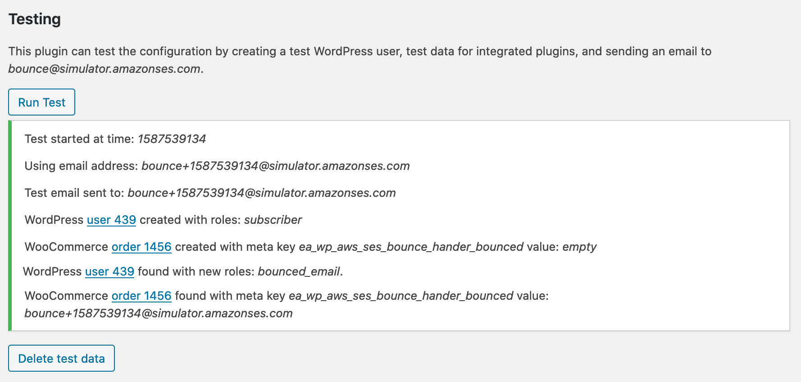

[](https://github.com/EnhancedAthlete/ea-wp-aws-ses-bounce-handler) [](https://github.com/WordPress-Coding-Standards/WordPress-Coding-Standards) []()

# AWS SES Bounce Handler

A WordPress plugin to unsubscribe users from email lists when AWS SES sends a bounce or complaint report.

## Overview

### Integrations

#### WordPress


#### WooCommerce


#### The Newsletter Plugin

> Newsletter is a real newsletter and email marketing system for your WordPress blog: perfect for list building, you can easily create, send and track e-mails, headache-free.

Bounced emails get deleted from lists and complaints get unsubscribed.

[Plugin on WordPress.org](https://wordpress.org/plugins/newsletter/) • [API documentation](https://www.thenewsletterplugin.com/documentation/newsletter-api)

## Overview

This plugin is for WordPress sites which are configured to send email using Amazon SES.

[What Is Amazon SES?](https://docs.aws.amazon.com/ses/latest/DeveloperGuide/Welcome.html)

> Amazon SES is an email platform that provides an easy, cost-effective way for you to send and receive email using your own email addresses and domains. 

[Amazon SES and Deliverability](https://docs.aws.amazon.com/ses/latest/DeveloperGuide/sending-concepts-deliverability.html)

> If your recipient's receiver (for example, an ISP) fails to deliver your message to the recipient, the receiver bounces the message back to Amazon SES. 
>
> ...
>
> Most email client programs provide a button labeled "Mark as Spam," or similar, which moves the message to a spam folder, and forwards it to the ISP. ... If the ISP concludes that you are a spammer, and Amazon SES has a feedback loop set up with the ISP, then the ISP will send the complaint back to Amazon SES.

[Monitoring Using Amazon SES Notifications](https://docs.aws.amazon.com/ses/latest/DeveloperGuide/monitor-sending-using-notifications.html)

> In order to send email using Amazon SES, you must have a system in place for managing bounces and complaints.

This plugin parses the bounce and complaint notifications, adds the "Bounced Email" role to user accounts, adds a notice to WooCommerce orders, and removes the email address from [the Newsletter plugin's](https://wordpress.org/plugins/newsletter/) lists. It also fires actions (`handle_ses_bounce`, `handle_ses_complaint`) for other plugins to consume.

## Installation

* Download the [latest release from GitHub](https://github.com/EnhancedAthlete/EA-WP-AWS-SNS-Client-REST-Endpoint/releases)
* Follow Amazon's [Configuring Amazon SNS Notifications for Amazon SES](https://docs.aws.amazon.com/ses/latest/DeveloperGuide/configure-sns-notifications.html) document
* Subscribe to the SNS topics using the endpoint in the settings page
 


## Verification

The plugin's settings page can set up test data and send a test email to _bounce@simulator.amazonses.com_ (see: [Testing Email Sending in Amazon SES](https://docs.aws.amazon.com/ses/latest/DeveloperGuide/mailbox-simulator.html)), allowing you to view the sample user/order/subscriber after receiving a bounce notification.


NB: When testing on your staging site, that must also be registered in SNS. 




## API

```
// Action to allow other plugins to act on SES bounce notifications.
add_action( 'handle_ses_bounce', 'my_bounce_handler', 10, 3 );

/**
 * Delete the bounced email address from mailing lists.
 *
 * @param string $email_address     The email address that has bounced.
 * @param object $bounced_recipient Parent object with emailAddress, status, action, diagnosticCode.
 * @param object $message           Parent object of complete notification.
 *
 * @see https://docs.aws.amazon.com/ses/latest/DeveloperGuide/notification-examples.html
 */
function my_bounce_handler( $email_address, $bounced_recipient, $message ) {

	if( class_exists( 'My_Email_Plugin' ) {
	
		My_Email_Plugin::remove_from_lists( $email_address );
	}
}
```

Also `handle_ses_complaint`.

A PHP interface exists for integrations to also perfom bounce tests on the settings page.

```
add_filter( 'ea_wp_aws_ses_bounce_handler_integrations', 'add_my_integration, 10, 1);

/**
 * @var SES_Bounce_Handler_Integration_Interface[] $integrrations Other registered integrations.
 */
function add_my_integration( $integrations ) {

	$integrations[ 'MyIntegrationName' ] = new class() implements SES_Bounce_Handler_Integration_Interface {
		...
	};
	
	return $integrations;
}
```

## Contributing

Clone this repo, open PhpStorm, then run `composer install` to install the dependencies.

```
git clone https://github.com/enhancedathlete/ea-wp-aws-ses-bounce-handler.git;
open -a PhpStorm ./;
composer install;
```

For integration and acceptance tests, a local webserver must be running with `localhost/ea-wp-aws-ses-bounce-handler/` pointing at the root of the repo. MySQL must also be running locally – with two databases set up with:

```
mysql_username="root"
mysql_password="secret"

# export PATH=${PATH}:/usr/local/mysql/bin

# Make .env available to bash.
export $(grep -v '^#' .env.testing | xargs)

# Create the databases.
mysql -u $mysql_username -p$mysql_password -e "CREATE USER '"$TEST_DB_USER"'@'%' IDENTIFIED WITH mysql_native_password BY '"$TEST_DB_PASSWORD"';";
mysql -u $mysql_username -p$mysql_password -e "CREATE DATABASE "$TEST_SITE_DB_NAME"; USE "$TEST_SITE_DB_NAME"; GRANT ALL PRIVILEGES ON "$TEST_SITE_DB_NAME".* TO '"$TEST_DB_USER"'@'%';";
mysql -u $mysql_username -p$mysql_password -e "CREATE DATABASE "$TEST_DB_NAME"; USE "$TEST_DB_NAME"; GRANT ALL PRIVILEGES ON "$TEST_DB_NAME".* TO '"$TEST_DB_USER"'@'%';";
```

### WordPress Coding Standards

See documentation on [WordPress.org](https://make.wordpress.org/core/handbook/best-practices/coding-standards/) and [GitHub.com](https://github.com/WordPress/WordPress-Coding-Standards).

Correct errors where possible and list the remaining with:

```
vendor/bin/phpcbf; vendor/bin/phpcs
```

### Tests

Tests use the [Codeception](https://codeception.com/) add-on [WP-Browser](https://github.com/lucatume/wp-browser) and include vanilla PHPUnit tests with [WP_Mock](https://github.com/10up/wp_mock). 

Run tests with:

```
vendor/bin/codecept run unit;
vendor/bin/codecept run wpunit;
vendor/bin/codecept run integration;
vendor/bin/codecept run acceptance;
```

To save changes made to the acceptance database:

```
export $(grep -v '^#' .env.testing | xargs)
mysqldump -u $TEST_SITE_DB_USER -p$TEST_SITE_DB_PASSWORD $TEST_SITE_DB_NAME > tests/_data/dump.sql
```

To clear Codeception cache after moving/removing test files:

```
vendor/bin/codecept clean
```

## Acknowledgements

Built by [Brian Henry](https://BrianHenry.ie) for:

[](https://EnhancedAthlete.com)